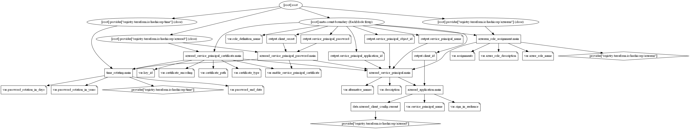

# Service Principal Terraform Module

Terraform module to create a service principal and assign required built-in roles. The outputs from this module, like application_id and password, can be used as an input in other modules.

To create a service principal and assign roles to the resources, this module needed elevated access in both Azure AD and Azure subscription. Therefore, it is not suggested to run from any CI/CD pipelines and advised to run manually to proceed with automated methods.

## Module Usage

```hcl
# Azurerm provider configuration
provider "azurerm" {
  features {}
}

module "service-principal" {
  source  = "kumarvna/service-principal/azuread"
  version = "2.3.0"


  service_principal_name     = "simple-appaccess"
  password_rotation_in_years = 1

  # Adding roles and scope to service principal
  assignments = [
    {
      scope                = "/subscriptions/xxxxx000-0000-0000-0000-xxxx0000xxxx"
      role_definition_name = "Contributor"
    },
  ]
}
```

## Create a service principal with a certificate

When you have an app or script that needs to access resources, you can set up an identity for the app and authenticate the app with its own credentials. This identity is known as a service principal. This approach enables you to:

* Assign permissions to the app identity that are different than your own permissions. Typically, these permissions are restricted to exactly what the app needs to do.
* Use a certificate for authentication when executing an unattended script.

This module creates the service principal using a certificate. This can be enabled by setting up `enable_service_principal_certificate = true` and provide the valid certificate path using the argument `certificate_path`.

```hcl
# Azurerm provider configuration
provider "azurerm" {
  features {}
}

module "service-principal" {
  source  = "kumarvna/service-principal/azuread"
  version = "2.3.0"

  service_principal_name               = "simple-appaccess"
  enable_service_principal_certificate = true
  certificate_path                     = "./cert.pem"
  password_rotation_in_years           = 1

  # Adding roles and scope to service principal
  assignments = [
    {
      scope                = "/subscriptions/xxxxx000-0000-0000-0000-xxxx0000xxxx"
      role_definition_name = "Contributor"
    },
  ]
}
```

> If you are using Client Certificate authentication, it's now possible to specify the certificate bundle data as an inline variable, in addition to the pre-existing method of specifying the filesystem path for a .pfx file. This may be useful when running Terraform in a non-interactive context, such as CI/CD pipelines.
> This can be enabled by replacing existing encoding value with argument `certificate_encoding = "base64"` and provide a valid .pfx certificate path using the argument `certificate_path`.

> The `hex` encoding option (`certificate_encoding = "hex"`) is useful for consuming certificate data from the `azurerm_key_vault_certificate` resource.

## Create X.509 Certificate with Asymmetric Keys

To create a self signed SSL certificate, execute the following OpenSSL command, replacing the -days and -subj parameters with the appropriate values:

```sh
openssl req -x509 -days 3650 -newkey rsa:2048 -out cert.pem -nodes -subj '/CN=simple-appaccess'
```

This command will create two files: `cert.pem` and `privkey.pem`. The `cert.pem` file contains the X.509 certificate with public key. This certificate will be attached to the Active Directory Application. The `privkey.pem` file contains the RSA private key that will be used to authenticate with Azure Active Directory for the Service Principal.

When self-signed certificates are not sufficient, sign your certificate using a Third-Party Certificate Authority such as Verisign, GeoTrust, or some other Internal Certificate Authority by generating a certificate signing request (CSR).

## Password rotation using `time_rotating`

Manages a rotating time resource, which keeps a rotating UTC timestamp stored in the Terraform state and proposes resource recreation when the locally sourced current time is beyond the rotation time. This rotation only occurs when Terraform is executed, meaning there will be drift between the rotation timestamp and actual rotation.

> From version 2.0 the AzureAD provider exclusively uses Microsoft Graph to connect to Azure Active Directory and has ceased to support using the Azure Active Directory Graph API.
> Azure Active Directory no longer accepts user-supplied password values. Passwords are instead auto-generated by Azure and exported with the value attribute

## Assign the application to a role

To access resources in your subscription, you must assign the application to a role. Decide which role offers the right permissions for the application. To learn about the available roles, see RBAC: [Built in Roles](https://docs.microsoft.com/en-us/azure/role-based-access-control/built-in-roles).

You can set the scope at the level of the subscription, resource group, or resource. Permissions are inherited to lower levels of scope. For example, adding an application to the Reader role for a resource group means it can read the resource group and any resources it contains. To allow the application to execute actions like reboot, start and stop instances, select the Contributor role.

```hcl
module "service-principal" {
  source  = "kumarvna/service-principal/azuread"
  version = "2.3.0"
  
  # .... omitted

  # Adding roles and scope to service principal
  assignments = [
    {
      scope                = "/subscriptions/xxxxx000-0000-0000-0000-xxxx0000xxxx"
      role_definition_name = "Contributor"
    },
  ]
}
```

## Requirements

Name | Version
-----|--------
terraform | >= 1.1.9
azurerm | >= 3.28.0

## Providers

| Name | Version |
|------|---------|
azurerm | >= 3.28.0
random | >= 3.1.0
azuread | >= 2.30.0
time | >= 0.7.1

## Inputs

Name | Description | Type | Default
---- | ----------- | ---- | -------
`service_principal_name` | The name of the service principal| string | `""`
`sign_in_audience`|The Microsoft account types that are supported for the current application. Must be one of `AzureADMyOrg`, `AzureADMultipleOrgs`, `AzureADandPersonalMicrosoftAccount` or `PersonalMicrosoftAccount`|string|`"AzureADMyOrg"`
`alternative_names`|A set of alternative names, used to retrieve service principals by subscription, identify resource group and full resource ids for managed identities|list(string)|`[]`
`description`|A description of the service principal provided for internal end-users|string|`null`
`role_definition_name`|The name of a Azure built-in Role for the service principal|string|`""`
`password_end_date`|The relative duration or RFC3339 rotation timestamp after which the password expire|string|`""`
`password_rotation_in_years`|Number of years to add to the base timestamp to configure the password rotation timestamp. Conflicts with password_end_date and either one is specified and not the both|string|`null`
`password_rotation_in_days`|Number of days to add to the base timestamp to configure the rotation timestamp. When the current time has passed the rotation timestamp, the resource will trigger recreation.Conflicts with `password_end_date`, `password_rotation_in_years` and either one must be specified, not all"|string|`null`
`enable_service_principal_certificate`|Manages a Certificate associated with a Service Principal within Azure Active Directory|string|`false`
`certificate_encoding`|Specifies the encoding used for the supplied certificate data. Must be one of `pem`, `base64` or `hex`|striing|`pem`
`key_id`|A UUID used to uniquely identify this certificate. If not specified a UUID will be automatically generated|string|`null`
`certificate_type`|The type of key/certificate. Must be one of `AsymmetricX509Cert` or `Symmetric`|string|`AsymmetricX509Cert`
`certificate_path`|The path to the certificate for this Service Principal|string|`""`
`azure_role_name`|A unique UUID/GUID for this Role Assignment - one will be generated if not specified|string|`null`
`azure_role_description`|The description for this Role Assignment|string|`null`
`assignments`|The list of role assignments to this service principal|list|`[]`

## Outputs

|Name | Description|
|---- | -----------|
`service_principal_name`|The name of the service principal
`service_principal_object_id`|The object id of service principal. Can be used to assign roles to user
`service_principal_application_id`|The application id of service principal
`client_id`|The application id of AzureAD application created
`client_secret`|Password for service principal
`service_principal_password`|Password for service principal

## Resource Graph



## Authors

Originally created by [Kumaraswamy Vithanala](mailto:kumarvna@gmail.com)

## Other resources

* [Azure AD Service Principal](https://docs.microsoft.com/en-us/azure-stack/operator/azure-stack-create-service-principals?view=azs-2002)
* [Azure built-in roles](https://docs.microsoft.com/en-us/azure/role-based-access-control/built-in-roles)
* [Terraform AzureRM Provider Documentation](https://www.terraform.io/docs/providers/azurerm/index.html)
